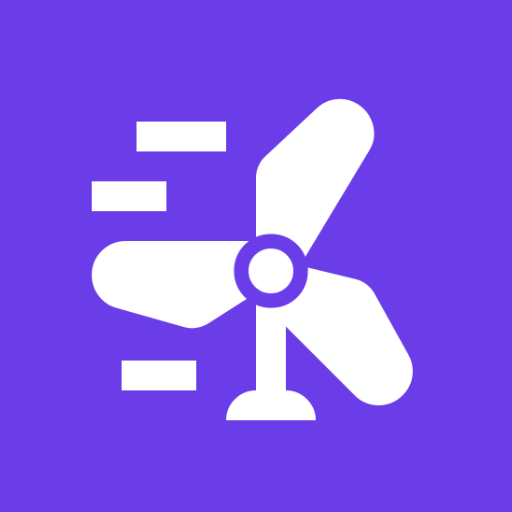
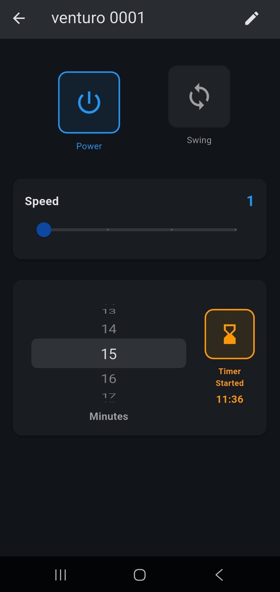
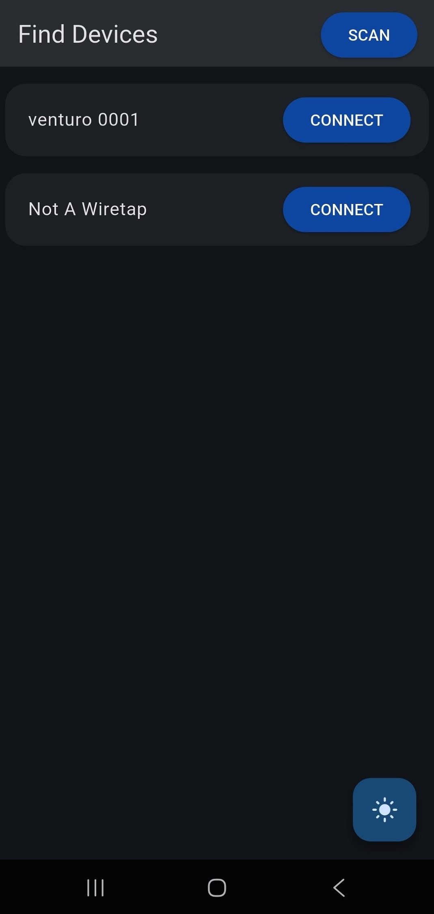
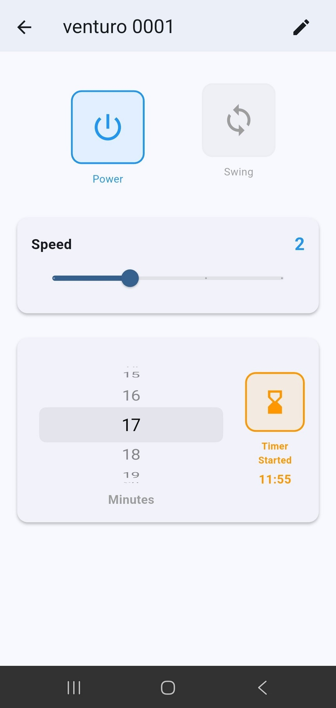
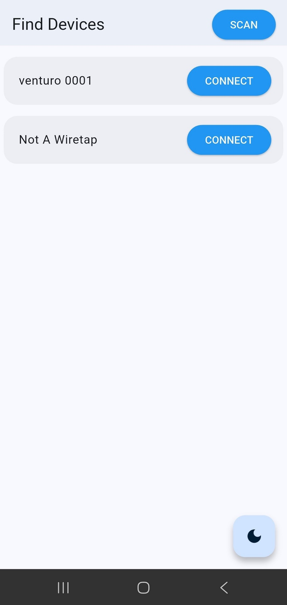

# Venturo_app 

This is the mobile app that controls [Venturo](https://github.com/vidunithaedirisooriya/Venturo) (previously known as RC_Fan_Upgrade_Mod). For convenience, I decided to make a mobile based controller for the project. This app uses [flutter_blue_plus](https://pub.dev/packages/flutter_blue_plus) for its BLE functionalities. The app can scan for nearby BLE devices, connect to them (automatically after the first time!), display the status of the fan and write commands to it. I have strived to make the design minimal and intuitive in hopes of being user friendly. The design was done in dark mode to ease the eyes (However, an option for light mode is included if that is what you fancy).

 

### BRIGHTNESS WARNING: LIGHT MODE SCREENSHOT INCOMING

 

##Specal thanks:
[flutter_blue_plus](https://pub.dev/packages/flutter_blue_plus) for their amazing library and the example sketch that make things clear
[IconKitchen](https://icon.kitchen/i/H4sIAAAAAAAAA6tWKkvMKU0tVrKqVkpLd87PyS9SslJSTgMDJR2lJISYWaJxSqqFUq2OUm5-SmkOSE-0UmJeSlF-ZgpQZWZ-MZAsT01Siq0FAI3686NWAAAA) for their help with the app icon.
